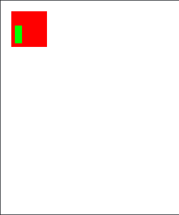

# Math Painter

An app that lets the user provide the start coordinates of geometrical shapes such as
squares and rectangles, their dimensions, and their colors, and the program produces an image file canvas with all
the geometrical shapes drawn in it.

```
$ python main.py

Enter canvas width: 50
Enter canvas height: 60
Enter canvas color (white or black): white
What would you like to draw (square or rectangle). Enter 'quit' to exit: square
Enter the x coordinate of the square: 3
Enter the y coordinate of the square: 3
Enter the length of the square side: 10
How much red color (0-255)? 255
How much green color (0-255)? 0
How much blue color (0-255)? 0
What would you like to draw (square or rectangle). Enter 'quit' to exit: rectangle
Enter the x coordinate of the rectangle: 7
Enter the y coordinate of the rectangle: 4
Enter the width of the rectangle: 5
Enter the height of the rectangle: 2
How much red color (0-255)? 0
How much green color (0-255)? 255
How much blue color (0-255)? 0
What would you like to draw (square or rectangle). Enter 'quit' to exit: quit
```


